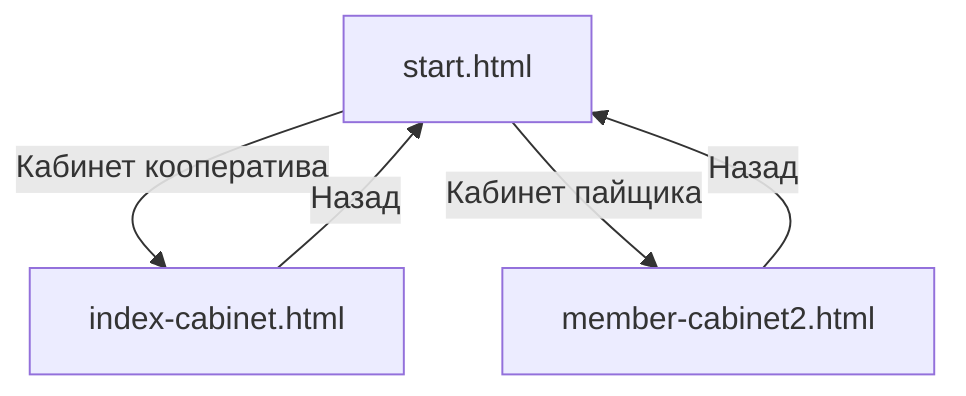

# 📱 НАВИГАЦИЯ ПО СИСТЕМЕ КООПЕРАНТ

## 🚀 Быстрый старт

### 1. Откройте стартовую страницу
```
start.html
```

### 2. Выберите роль

#### 🏢 **Кабинет кооператива**
- **Файл:** `index-cabinet.html`
- **Для кого:** Председатель, бухгалтер
- **Возможности:**
  - ✅ Управление пайщиками
  - ✅ Учёт взносов
  - ✅ Бухгалтерия и отчёты
  - ✅ Документооборот

#### 👤 **Кабинет пайщика**
- **Файл:** `member-cabinet2.html`
- **Для кого:** Члены кооператива
- **Возможности:**
  - ✅ Информация о членстве
  - ✅ История взносов
  - ✅ Документы
  - ✅ Заявления

---

## 📁 Структура файлов

```
! КООП/
├── start.html              # ⭐ Стартовая страница (выбор роли)
├── index-cabinet.html      # 🏢 Кабинет кооператива (новый дизайн)
├── index.html              # 🏢 Кабинет кооператива (Telegram-стиль)
├── member-cabinet2.html    # 👤 Кабинет пайщика
└── ... другие файлы
```

---

## 🔄 Навигация



---

## 🎨 Особенности дизайна

### index-cabinet.html (новый)
- ✅ Современный карточный дизайн
- ✅ Боковое меню с категориями
- ✅ Табы для навигации
- ✅ Адаптивный дизайн
- ✅ Поддержка Telegram WebApp

### index.html (классический)
- ✅ Стиль Telegram-мессенджера
- ✅ Список чатов слева
- ✅ Центральная область
- ✅ Правые панели

---

## 📱 Мобильная версия

Обе версии поддерживают мобильные устройства:
- Адаптивное меню
- Свайп-жесты
- Тактильная отдача (Telegram)
- Тёмная тема

---

## ⚙️ Настройки

### Выбор роли
При первом входе система запомнит выбранную роль.  
Для смены роли:
1. Откройте `start.html?select=true`
2. Или очистите `localStorage`

### Тёмная тема
- Переключатель в настройках
- Сохраняется в `localStorage`

### Яндекс.Диск
- Автоматическая синхронизация
- Резервное копирование

---

## 🔧 Технические файлы

| Файл | Назначение |
|------|------------|
| `app.js` | Основное приложение |
| `reports.js` | Генерация отчётов |
| `application_functions.js` | Функции приложения |
| `settings.js` | Настройки |
| `yandex-disk-integration-v2.js` | Интеграция с Яндекс.Диском |
| `pdf_export.js` | Экспорт в PDF |

---

## 📊 Отчёты

### Бухгалтерия
- ОСВ (оборотка)
- Бухгалтерский баланс (Форма №1)
- Отчёт о фин. результатах (Форма №2)

### Налоги
- КУДиР УСН
- Декларация УСН
- РСВ
- СЗВ-СТАЖ
- 6-НДФЛ

### Управленческий учёт
- Реестр пайщиков
- Отчёт по взносам
- Фонды
- Собрания
- Календарь событий

---

## 💡 Советы

1. **Для быстрого доступа** используйте стартовую страницу `start.html`
2. **Для мобильной версии** рекомендуется `index-cabinet.html`
3. **Для работы в Telegram** подходит любая версия
4. **Для резервного копирования** подключите Яндекс.Диск

---

**Версия:** 5.0.0  
**Последнее обновление:** 2026
